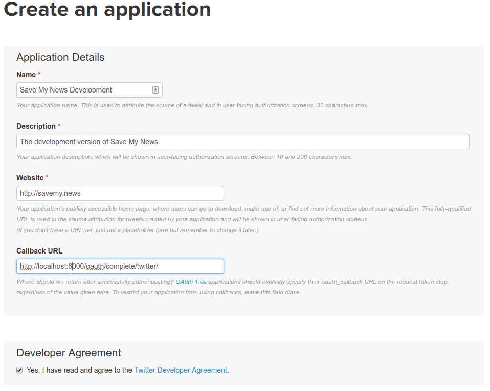

# Save My News

A personal, permanent clipping service at [savemy.news](http://savemy.news/)

[](https://travis-ci.org/pastpages/savemy.news)

### Getting started

Requirements:

* Python
* PostgreSQL
* virtualenv or virtualenvwrapper
* Git

Create a virtualenv to store the codebase.

```bash
# If you prefer virtualenvwrapper, pyenv, conda, whatever, use that here instead of course
$ virtualenv savemy.news
```

Activate the virtualenv.

```bash
$ cd savemy.news
$ . bin/activate
```

Clone the git repository from GitHub.

```bash
# If you've made a fork, substitute in your URL
$ git clone git@github.com:pastpages/savemy.news.git repo
```

Enter the project and install its dependencies.

```bash
$ cd repo
$ pip install -r requirements.txt
```

Create a copy of a local settings file for your development environment.

```bash
$ cp project/settings_dev.py.tmpl project/settings_dev.py
```

Visit [apps.twitter.com](http://apps.twitter.com) and create a new application.

Set the callback URL setting as `http://localhost:8000/oauth/complete/twitter/`.



Go to the "Keys and Access Tokens" tab.

Copy the two secret keys and add them to your `settings_dev.py` file.

```python
SOCIAL_AUTH_TWITTER_KEY = '<Consumer Key (API Key) goes here>'
SOCIAL_AUTH_TWITTER_SECRET = '<Consumer Secret (API Secret) goes here>'
```

Create a local database.

```bash
$ python manage.py migrate
```

Run the test server for the first time.

```bash
$ python manage.py runserver
```
